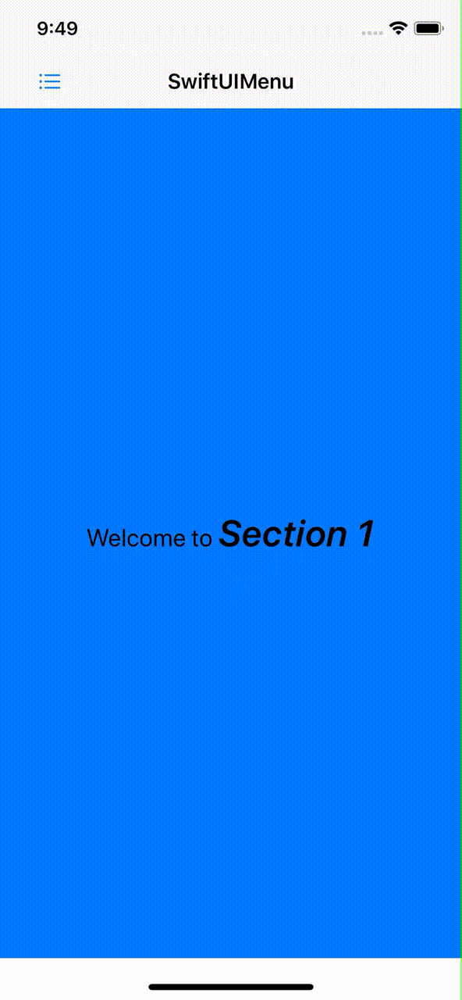
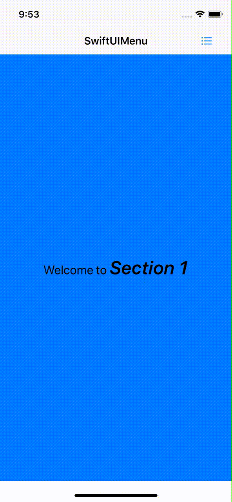
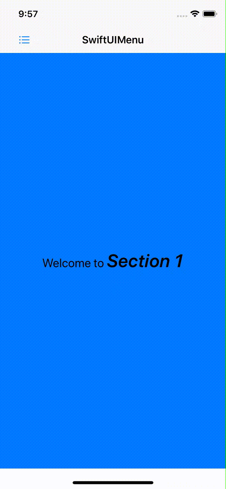
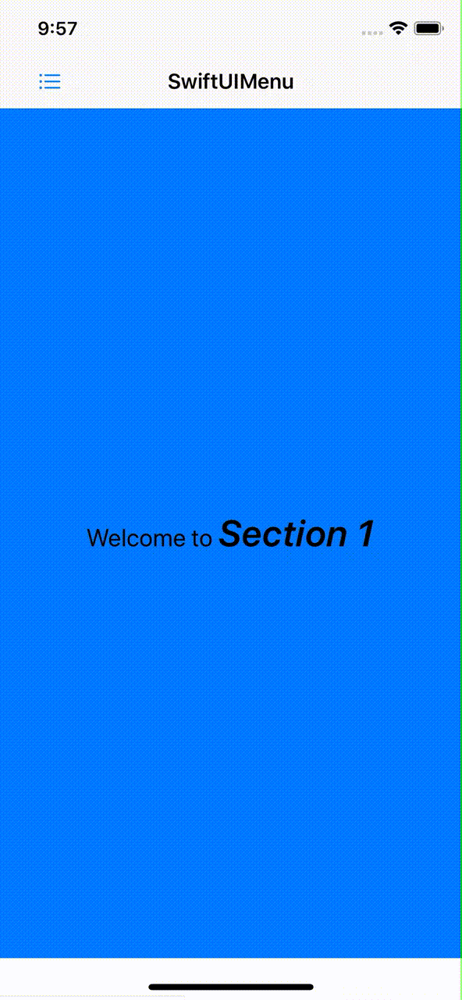

# SwiftUIMenu

[](https://github.com/apple/swift-package-manager)
[](https://cocoapods.org/pods/SwiftUIMenu)
[](https://github.com/Carthage/Carthage)
[](https://cocoapods.org/pods/SwiftUIMenu)
[](https://opensource.org/licenses/MIT)

SwiftUIMenu is a component that allows you to implement Menu Navigation Pattern in your App. `Menu` presents a content and a list of of options that's easily displayed by swiping or reacting to an external event such as a navbar button tap.

## Requirements
* iOS 13.0+
* macOS 10.15+
* watchOS 6.0+
* Swift 5.1+

## Installation

### CocoaPods
```
pod 'SwiftUIMenu'
```
### Swift Package Manager

Go to XCode:
* File -> Swift Packages -> Add Package Dependency...
* Use the URL https://github.com/fermoya/SwiftUIMenu.git

### Carthage

```
github "fermoya/SwiftUIMenu"
```

## Usage

### Initialization

You can create a `Menu` by passing:
- Binding to the selected index
- Binding to determine if `Menu` is open
- Array of items to populate the menu
- `ViewBuilder` to build each row
- `ViewBuilder` to build the content for the selected index

```swift
Menu(indexSelected: self.$index,
     isOpen: self.$isMenuOpen,
     menuItems: menuItems,
     menuItemRow: { index in
         Text("Option \(index)")
     },
     menuItemContent: { section in
         Text("Welcome to section \(section)")
     })
})
```


### UI customization

There're plenty of view-modifiers available to customize your `Menu` and give it a personal touch. You can specify its position, style or add a header, among others. 

By default, `Menu` is configured to:
- Reveal from the left
- Have an overlap style
- Take up the whole screen
- Allow dragging

#### Alignment

Changes the position of the menu so that it reveals from the left or right of the screen.

```swift
Menu(...)
    .alignment(.right)
```

##### Left Menu



##### Right Menu



#### Header & Footer

Use these modifiers to add a header and/or footer to `Menu`.

```swift
Menu(...)
    .header { MyMenuHeader() } 
    .footer { MyMenuFooter() } 
```


#### Style

Adds a different effect to the way `Menu` is revealed.

```swift
Menu(...)
    .style(.stretch)
```

##### Overlap


##### Push



##### Stretch



#### More features

You can also:
- Change the ratio of available space that `Menu` will take up when open with `revealRatio`
- Disable the `DragGesture` with `disableDragging`
- Make the content dismiss `Menu` by a simple tap with `allowContentTap()`
- Shade the content when `Menu` is open with `shadeContent`

```swift
Menu(...)
    .revealRatio(0.8)
    .shadeContent()
```

### Sample projects

For more information, please check the [sample app](/Example). 

Your feedback is more than welcome, don't hesitate to open an issue or ping me at [fmdr.ct@gmail.com](mailto:fmdr.ct@gmail.com).  

Feel free to collaborate and make this framework better. 

## License  

`SwiftUIMenu` is available under the MIT license. See the [LICENSE](/LICENSE) file for more info.
